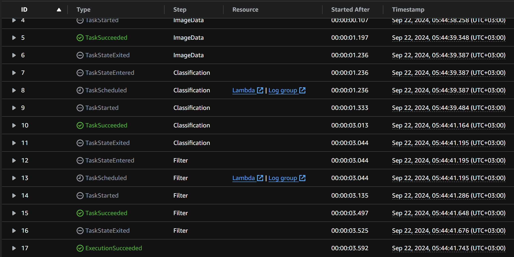

# Build-a-ML-Workflow-For-On-Amazon-SageMaker

# Scones Unlimited: Image Classification Step Functions Project

## Project Overview

This project leverages AWS Lambda, SageMaker, and Step Functions to build an image classification pipeline for the Scones Unlimited platform. The core workflow performs the following tasks:

1. **Image Data Serialization:** Reads an image from S3, base64 encodes it, and prepares it for classification.
2. **Model Inference:** Uses a pre-trained image classification model deployed on SageMaker to predict whether the image is a bicycle or motorcycle.
3. **Confidence Filter:** Filters out predictions that do not meet a predefined confidence threshold (e.g., 70%). If the confidence is below the threshold, the workflow raises an exception, allowing the operations team to review low-confidence predictions.

## Architecture

The project uses AWS services and technologies to build a scalable, serverless image classification pipeline:

- **AWS Lambda:** Handles serialization of image data, invokes SageMaker for model inference, and filters low-confidence predictions.
- **AWS SageMaker:** Hosts a machine learning model for classifying images of bicycles and motorcycles.
- **AWS Step Functions:** Orchestrates the entire workflow, chaining Lambda functions together in a logical order and handling retries and error handling.
- **S3:** Stores the input images for classification and captures model inference data for monitoring.

## Workflow Steps

1. **Serialize Image Data:**
    - This Lambda function reads the image file from S3, base64 encodes the image, and passes the encoded data for further processing.
    
2. **Image Classification with SageMaker:**
    - The base64 encoded image is passed to the SageMaker model endpoint to predict the class of the image (bicycle or motorcycle).
    
3. **Confidence Filtering:**
    - A threshold-based filtering Lambda function checks if any of the predictions exceed the predefined confidence threshold (e.g., 0.70). If the confidence is below the threshold, the workflow raises an exception.

## Key Features

- **Step Function Orchestration:** The core logic is defined in AWS Step Functions, which chains Lambda functions in the following order: serialization → inference → filtering.
- **Error Handling:** Step Functions allow retries on specific failures such as timeouts or service limits. Additionally, the final step (confidence filtering) is designed to "fail loudly" when predictions fall below the confidence threshold.
- **Threshold Configuration:** The filtering Lambda allows for flexible tuning of confidence thresholds, which can be adjusted to meet the operational requirements of the system.

## Visualizing the ML Model Performance

To monitor and visualize the model's inference results, captured data from SageMaker is downloaded and analyzed. This data includes both input images and inference results.

### Visualization Example

Here’s a sample visualization showing the confidence levels of recent inferences:

```python
# Populate the data for the x and y axis
x = []
y = []
for obj in json_data:
    inference, timestamp = simple_getter(obj)
    
    y.append(max(inference))  # Get max confidence score from inference
    x.append(timestamp)  # Get timestamp for visualization

# Plot the data
plt.scatter(x, y, c=['pink' if k < 0.94 else 'blue' for k in y])  # Pink for low confidence, blue for high
plt.axhline(y=0.94, color='pink', linestyle='--')  # Confidence threshold line
plt.ylim(bottom=0.88)

# Add labels and titles
plt.ylabel("Confidence")
plt.suptitle("Observed Recent Inferences", size=14)
plt.title("Pictured with confidence threshold for production use", size=10)

# Show the plot
plt.gcf().autofmt_xdate()
plt.show()
```

## Screenshots

### Step Function Execution:
- **Successful Execution:**
  
  

- **Failed Execution:**
  
  
  
### Execution Flow:


### Confidence Visualization:


## Challenges and Stretch Goals

### Error Handling and Failures:
Implementing effective error handling was essential for this project. In the final Lambda function, if the prediction confidence is below the defined threshold (e.g., 70%), an exception is raised, causing the Step Function to fail. This ensures low-confidence predictions are reviewed by the operations team, adhering to best practices for error handling in workflows.

### Data Capture and Visualization:
We used SageMaker's data capture feature to log inferences during execution. By storing and analyzing these logs, we visualized the model’s performance over time, adjusted the confidence threshold accordingly, and ensured that only reliable predictions were processed by the workflow.

## How to Run This Project

1. **Clone the Repository:**
   - Download the Lambda function code and relevant files from this repository.

2. **Create Lambda Functions:**
   - Deploy three Lambda functions to AWS (SerializeImageData, Classification, and Filter) using the provided code.

3. **Set Up SageMaker:**
   - Deploy a pre-trained image classification model using SageMaker.

4. **Create the Step Function:**
   - Use AWS Step Functions’ visual editor to create a workflow that chains together the Lambda functions (SerializeImageData → Classification → Filter).

5. **Test the Workflow:**
   - Use images from the `./test` folder or generate test cases using the provided helper function to validate the workflow.

6. **Visualize Data:**
   - Use SageMaker Model Monitor to download inference logs and visualize the model’s confidence levels over time.

## Future Improvements

- **Model Performance Tuning:** Improve model accuracy and performance by fine-tuning the SageMaker model.
- **Support for More Classes:** Expand the model to classify additional categories beyond bicycles and motorcycles.
- **Advanced Monitoring:** Implement more sophisticated monitoring tools to track model performance, detect data drift, and analyze accuracy trends in real-time.
